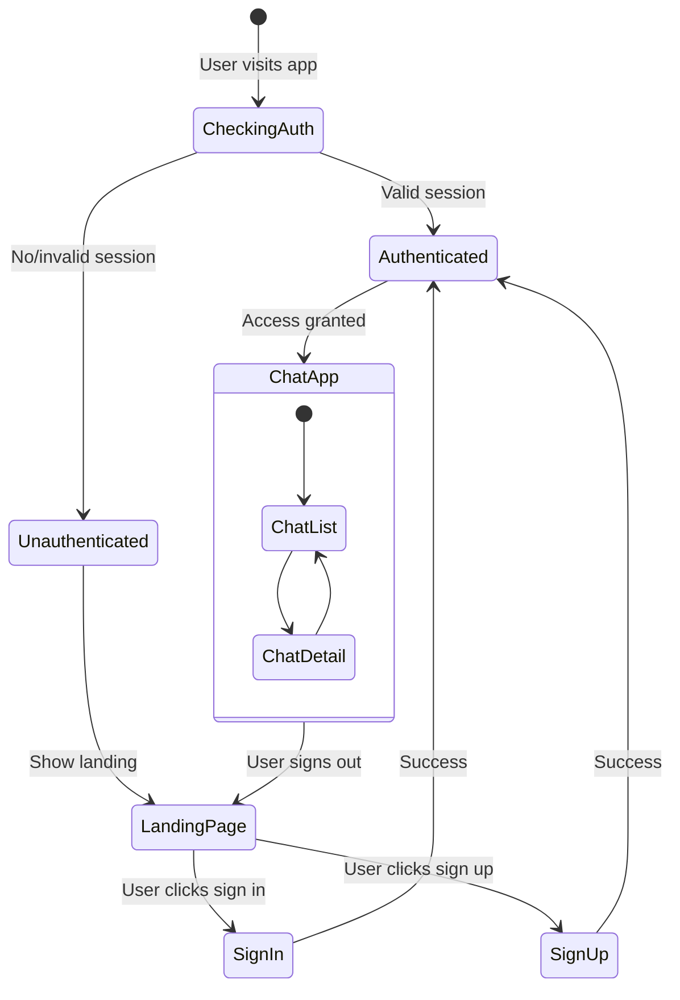

# Design Document

## Overview

This design implements comprehensive route protection and authentication flow improvements for the tarot chat application. The solution creates a proper landing page for unauthenticated users, implements middleware-based route protection, and ensures smooth authentication state transitions with proper redirects.

## Architecture

### Current State Analysis
- The app currently redirects unauthenticated users from "/" to "/signin"
- Chat routes lack explicit authentication protection
- Sign out doesn't redirect users appropriately
- No welcoming landing page exists for new users

### Proposed Architecture
- **Landing Page**: New root page component that serves different content based on auth state
- **Route Protection Middleware**: Next.js middleware to protect chat routes
- **Authentication Flow**: Enhanced redirect logic in auth components
- **State Management**: Improved session handling with proper redirects

## Components and Interfaces

### 1. Landing Page Component (`src/components/Home.tsx`)
```typescript
interface LandingPageProps {
  // No props needed - will use useSession internally
}

// Features:
// - Hero section with app description
// - Key features showcase
// - Authentication buttons
// - Responsive design matching current theme
```

### 2. Route Protection Middleware (`src/middleware.ts`)
```typescript
interface MiddlewareConfig {
  matcher: string[];
}

// Features:
// - Protects /chat and /chat/* routes
// - Redirects unauthenticated users to "/"
// - Allows authenticated users through
// - Handles session validation
```

### 3. Enhanced Root Page (`src/app/page.tsx`)
```typescript
// Updated logic:
// - Authenticated users → redirect to /chat
// - Unauthenticated users → show landing page
// - No more automatic redirect to /signin
```

### 4. Updated Authentication Components
- **AuthStatus**: Enhanced with proper redirect handling
- **SignIn/SignUp Forms**: Updated callback URLs and redirect logic
- **Sign Out**: Immediate redirect to landing page

## Data Models

### Authentication State Flow


### Route Protection Logic
```typescript
// Protected routes pattern
const protectedRoutes = ['/chat', '/chat/:path*'];

// Middleware logic
if (isProtectedRoute && !isAuthenticated) {
  return redirect('/');
}

if (isAuthRoute && isAuthenticated) {
  return redirect('/chat');
}
```

## Error Handling

### Session Expiration
- **Detection**: Middleware catches expired sessions
- **Response**: Graceful redirect to landing page
- **User Experience**: Clear messaging about session timeout

### Authentication Failures
- **Sign In/Up Errors**: Toast notifications with specific error messages
- **Network Issues**: Retry mechanisms and fallback states
- **Invalid Redirects**: Default fallback to appropriate page based on auth state

### Route Access Errors
- **Unauthorized Access**: Immediate redirect without error flash
- **Invalid Chat IDs**: Proper error handling in chat routes
- **Missing Resources**: Graceful degradation with user feedback

## Testing Strategy

### Unit Tests
- Landing page component rendering for different auth states
- Middleware logic for various route scenarios
- Authentication flow functions
- Redirect logic validation

### Integration Tests
- Complete authentication flows (sign in → chat → sign out → landing)
- Route protection across different user states
- Session expiration handling
- Cross-browser authentication state persistence

### E2E Tests
- User journey from landing page to authenticated chat
- Sign out flow and proper redirects
- Protected route access attempts
- Authentication state persistence across page refreshes

## Implementation Details

### Landing Page Design
- **Hero Section**: App name, tagline, and brief description
- **Features Section**: Key tarot chat capabilities
- **Call-to-Action**: Prominent sign in/sign up buttons
- **Styling**: Consistent with existing design system
- **Responsive**: Mobile-first approach

### Middleware Implementation
- **File Location**: `src/middleware.ts` (Next.js convention)
- **Route Matching**: Specific patterns for chat routes
- **Session Validation**: Integration with Better Auth
- **Performance**: Minimal overhead for public routes

### Authentication Enhancements
- **Sign Out**: Updated to use router.push('/') after signOut()
- **Callback URLs**: Consistent '/chat' destination for successful auth
- **Error Handling**: Improved user feedback for auth failures
- **State Synchronization**: Proper session state updates

### Redirect Logic
```typescript
// Root page logic
if (session?.user) {
  redirect('/chat');
} else {
  // Render landing page component
}

// Auth pages logic
if (session?.user) {
  redirect('/chat');
}

// Sign out logic
await signOut();
router.push('/');
```

## Security Considerations

### Route Protection
- Server-side session validation in middleware
- No client-side only protection
- Proper handling of authentication edge cases

### Session Management
- Secure session storage via Better Auth
- Automatic session cleanup on sign out
- Protection against session fixation

### Redirect Security
- Validated redirect URLs to prevent open redirects
- Consistent redirect patterns
- No sensitive data in redirect URLs

## Performance Optimizations

### Middleware Efficiency
- Minimal processing for non-protected routes
- Efficient session validation
- Proper caching of authentication state

### Component Loading
- Lazy loading of landing page components
- Optimized authentication state checks
- Minimal re-renders on auth state changes

### User Experience
- Fast authentication state detection
- Smooth transitions between auth states
- Minimal loading states and flickers